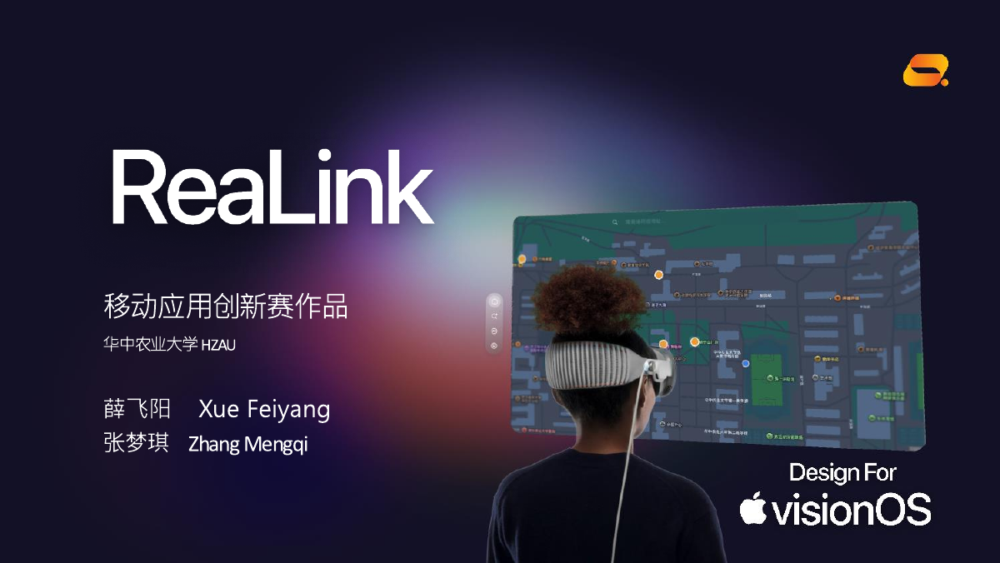
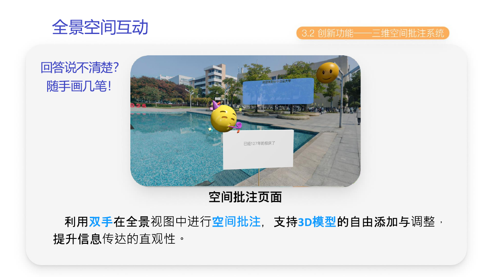
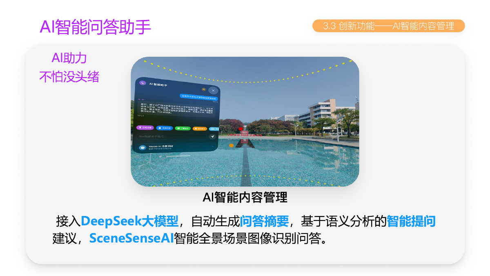
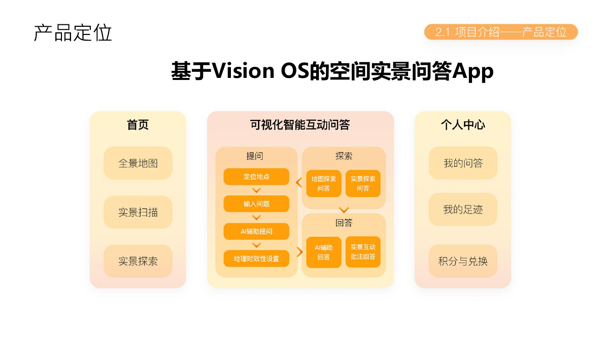
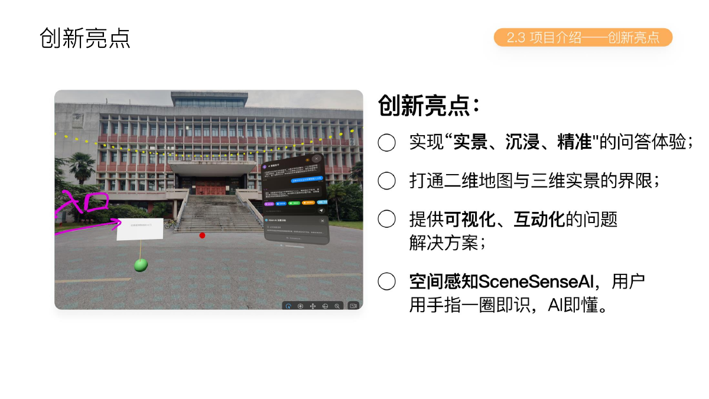

# ReaLink

基于 visionOS 的空间实景问答 App。ReaLink 把地点、全景/实景画面和问答放在同一个空间里，让用户先看懂环境，再围绕眼前的位置提问、探索和交流。

| 入口 | 地址 |
|---|---|
| GitHub | [douerlucky/ReaLink-Swift](https://github.com/douerlucky/ReaLink-Swift) |
| 平台 | Apple visionOS / Vision Pro 原型 |
| 项目材料 | `docs/images/` 中的答辩图与界面图 |

## 为什么需要空间问答

文字和二维图片很难完整表达大型商场、校园、景区或陌生城市中的空间关系。用户经常到了现场才发现位置不对、店铺未营业或路线不清楚；传统问答平台又只能在文字和图片之间来回切换，无法把问题放回它真实发生的地方。

ReaLink 的目标是让“我在哪里、我看到了什么、我想知道什么”同时出现在一个可探索的空间中。

## 使用流程

1. 在地图或地点列表中选择一个现实场景。
2. 浏览全景/实景内容，看到场景中的问题位置和相关信息。
3. 进入沉浸式空间，围绕当前地点浏览问题、查看回答或参与提问。
4. 需要更直观说明时，在场景中进行空间批注、放置 3D 内容，或打开 AI 问答助手。

## 核心体验

### 沉浸式空间问答

问题不再只是列表中的一行文字，而是与场景中的位置关联。用户可以在全景画面中看到问题气泡，直接选择、查看或参与回答。

### 全景空间互动

用户可以在空间中进行浏览和探索，并通过空间批注把信息放回具体位置。答辩材料中的原型还展示了 3D 模型添加和调整的交互方式。

### AI 智能问答助手

AI 助手用于整理回答、理解自然语言问题，并辅助用户在场景中获得更具体的解释。它是空间体验的一部分，而不是脱离地点的普通聊天窗口。

## 产品定位与创新

| 方向 | ReaLink 的做法 |
|---|---|
| 空间信息 | 将地点、全景画面、问题和回答关联起来 |
| 交互方式 | 用空间浏览、位置标记和沉浸式场景传递信息 |
| 问答体验 | 支持现场提问、查看已有问题和 AI 辅助回答 |
| 内容表达 | 通过空间批注和 3D 内容补足文字与平面图片的不足 |

## 项目成果

- 中国高校计算机大赛·移动应用创新赛 2025 全国三等奖。
- 2025 年华中赛区一等奖。
- 项目答辩材料和主要界面图保存在仓库的 `docs/images/` 目录，便于评审直接查看产品思路与交互结果。

## 代码说明

- 工程：`ReaLink.xcodeproj`。
- 平台：visionOS 和 visionOS Simulator。
- 主要代码目录：`Explore/`（场景探索）、`RealSpace/`（实景空间）、`Question/`（问题与位置）、`QandA/`（问答）、`AIAssistant/`（AI 助手）、`3DModel/`（3D 内容交互）。
- 资源目录：`ReaLink3DModel/` 和 `Packages/RealityKitContent/`。

使用 Xcode 打开工程并选择 visionOS 目标即可查看界面和交互代码。工程中的网络层默认面向本地开发服务（例如 `localhost:3000`），这只是开发配置，不代表仓库提供公开后端；运行前请按自己的环境配置服务地址，不要提交密钥或真实账号。

## 当前边界

这是一个面向 visionOS 的产品原型和竞赛项目。地图、沉浸式空间、空间批注、AI 问答和 3D 内容的实际可用范围取决于本地服务、设备能力和演示数据；README 展示的是项目已经实现或在答辩材料中呈现的产品方向，不把未来规划写成线上服务承诺。

## 隐私与安全

地点、相机、空间感知和问答内容都可能包含敏感信息。请使用脱敏的演示数据；不要把 API Key、服务器凭证、用户账号或本地网络配置提交到公开仓库。
